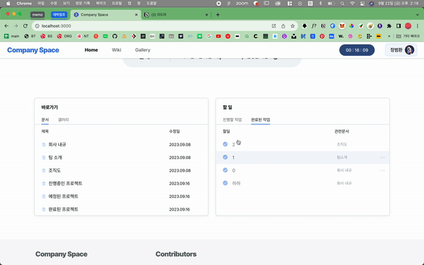
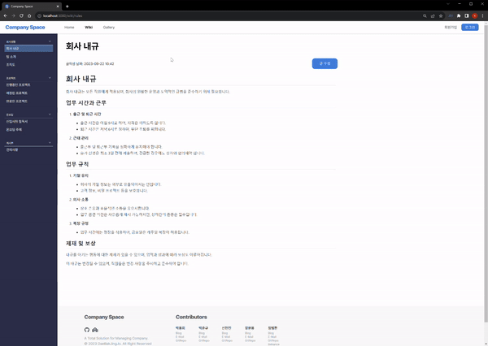
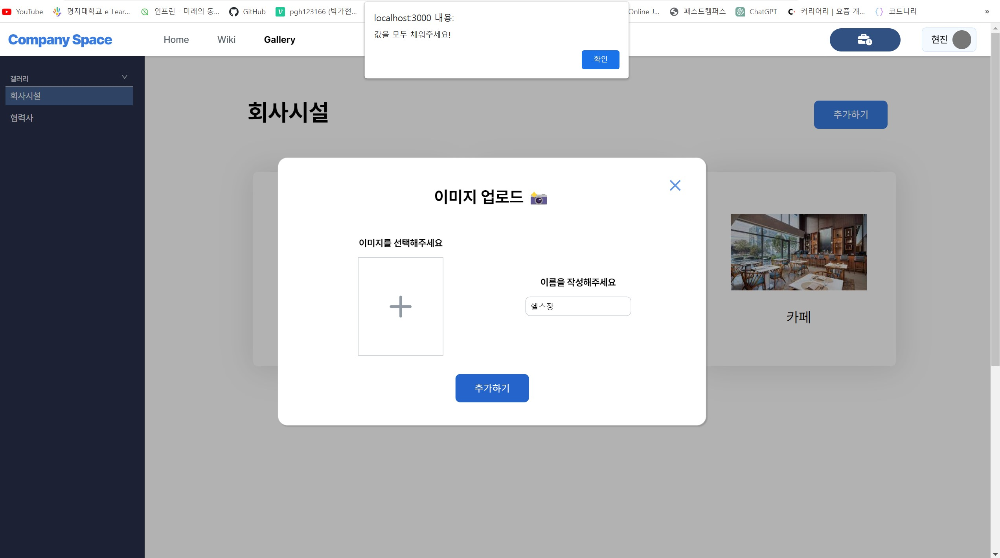
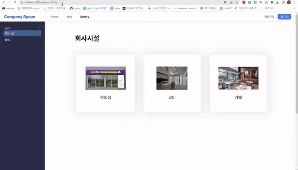

# 🚀 Company Space 🚀

 

> 회사의 직원들을 위한 위키사이트입니다!
> 출/퇴근 시간 기록, todo 관리, wiki 문서 수정, 갤러리 데이터 수정이 가능합니다.

 

## 🪐 프로젝트 기간

---

**2023.09.08 ~ 2023.09.22**

 

## 🪐 배포 링크

---

<a href="https://glittering-speculoos-415dd0.netlify.app/">🚀 Company Space 🚀</a>

 

## 🪐 기술 스택 / 라이브러리

---

✔️ **언어**

✔️ **백엔드(DB)**

✔️ **라이브러리**

**✔️ 협업**

✔️ **디자인**

✔️ **코드 포맷 및 오류 도구**

 

## 🪐 팀원 정보

---

### 🏅2조 - 대박징조

<table>
  <tbody>
    <tr>
      <td align="center"><a href="https://github.com/xxxjinn"> <b>팀장 : 신현진</b></a> </td>
      <td align="center"><a href="https://github.com/junkue20"> <b>팀원 : 박준규 </b></a> </td>
      <td align="center"><a href="https://github.com/YongYong21"> <b>팀원 : 박용희</b></a> </td>
     </tr>
     <tr><td align="center"><a href="https://github.com/Bumang-Cyber"> <b>팀원 : 정범환</b></a> </td>
      <td align="center"><a href="https://github.com/moonyah"> <b>팀원 : 장문용</b></a> </td></tr>
  </tbody>
</table>

 
## 🪐 구현 사항 체크
---

### 🌟 필수 구현 사항

- [x] 문서편집, revision 기능을 제공(CRUD 가능하게)하여 업무일지를 작성할 수 있는 직원들을 위한 위키사이트 구현(마크다운 형식)
- [x] firebase database (Firestore) 이용
- [x] 모달을 활용한 근무 시간을 표시하는 시계 및 타이머 창 구현
- [x] 캐러셀을 활용한 회사 공지 페이지
- [x] **갤러리 페이지 / 업무일지 페이지 등 메뉴를 필터링 또는 카테고리화 하는 선택바 구현**
- [x] netlify 등을 이용한 정적 페이지 배포
- [x] TypeScript 사용 필수
- [x] 과제에 대한 설명을 포함한 `README.md` 파일 작성

 

### 🌟 선택 구현 사항

- [x] React 사용
- [x] 기타 동작이 완료되기 전에 로딩 애니메이션 구현
- [x] 페이지네이션
- [x] 관련된 기타 기능 고려
- [x] eslint 설정, 커밋컨벤션, 문서화 등 팀프로젝트시 필요한 추가 작업들

 

## 🪐 페이지 및 역할, 기능 소개

---

### 💫 화면 구성

<table>
  <tbody>
    <tr>
      <td align="center"><h4>[메인 페이지]</h4> </a> </td>
      <td align="center"><h4>[위키 페이지]</h4> </a> </td>
      <td align="center"><h4>[갤러리 페이지]</h4> </a> </td>
      </tr>
    <tr>
     <td align="center"><h4>[로그인 페이지]</h4> </a> </td>
    <td align="center"><h4>[회원가입 페이지]</h4> </a> </td>
      <td align="center"><h4>[비밀번호 찾기 페이지]</h4> </a> </td>
    </tr>
    <tr>
      <td align="center"><h4>[출퇴근 모달]</h4> </a> </td>
      <td align="center"><h4>[404 페이지]</h4> </a> </td>
    </tr>
  </tbody>
</table>

 

### 💫 각 조원 별 역할, 기능 소개

---

🌟 메인 페이지, 헤더, 푸터 - 정범환

 
💡 메인 페이지에서 기간 별로 할일 목록을 관리하고, 위키나 갤러리를 요약하여 보거나 바로 이동할 수 있습니다.

 
 

- 캐로셀을 활용하여 기능들을 소개하였습니다.
  

 

- 로그인할 시 사용자의 이름을 표출하고 기간 별로 할일 목록과 완료된 일 목록을 볼 수 있습니다.

    
    
    
    
     

  - 비로그인 상태에서는 기능 소개 문구로 대체됩니다.

 

- 할일 목록과 완료된 일 목록을 생성하고, 관련 문서를 지정하고 추가, 수정 및 삭제할 수 있습니다.

    
    
     

  - 비로그인 상태에서는 내용을 추가할 수 없고 읽기 모드로만 작동합니다.

 

- 메인페이지에서 위키와 갤러리를 요약해서 보고, 원하는 파일로 바로가기 할 수 있습니다.
  

 

- 문서 목록에서 특정 문서에 관련된 할 일을 생성할 수 있습니다.

    
    
     

  - 비로그인 상태에서는 내용을 추가할 수 없고 읽기 모드로만 작동합니다.

 

- 헤더에서 사용자의 이름을 보여주고 원하는 페이지로 이동할 수 있습니다.
  

 

- 푸터에 참여자들의 contact 수단들을 정리하였습니다.

    
    
     

  - 팀 깃 레포지토리와 패스트캠퍼스 페이지로도 이동할 수 있습니다.

 

- 추가적인 역할: 전반적인 디자인 에셋과 가이드라인, 디자인 컴포넌트를 피그마로 관리하여 팀원들이 뽑아 쓸 수 있게 만들었습니다.
  
  

 

🌟 위키 페이지, 사이드바 - 박용희

 

💡문서 데이터 CRUD기능을 파이어베이스와 연동하여 구현했습니다.

 

- **사이드 메뉴**

  - Firebase에 저장된 데이터를 불러오고, 사용자가 클릭에 따라 UI가 바뀌어집니다.

      

      
    
- **글 수정**
    - Firebase에 저장된 데이터를 불러오고, 데이터를 마크다운 문법으로 보여줍니다.
    - 로그인의 여부에 따라서 글 수정 가능을 사용할 수 있습니다.
    - 글 수정을 할 경우, Fireabse에 저장된 데이터를 Update 해줍니다.

     

    - 로그인 상태

        

     

    - 비로그인 상태

        

         

        - URL로 이동 시

            

 

- **건의사항**

  - Firebase에 저장된 데이터를 불러오고, 데이터를 보여줍니다.
  - 로그인의 여부에 따라서 글 추가 삭제 가능을 사용할 수 있습니다.
  - 글 추가 및 삭제를 할 경우, Fireabse에 저장된 데이터를 Create, Delete 합니다.

     

  - 모달창
    

     
        
    - 로그인 상태 - 추가
        
        

     

  - 로그인 상태 - 삭제
    

     
        
    - 비로그인 상태 - 삭제
        
        

 

- **404 페이지 이동**

  - wiki/:id 속성을 이용하여 라우터를 사용했기 때문에 id값을 비교하여 해당 id가 없을 경우, 404페이지로 이동합니다.

      

 

 

🌟 갤러리 페이지, 404페이지 - 신현진

 
💡 사진 데이터 추가/삭제 기능(갤러리 페이지)과 404페이지를 구현하였습니다. 추가적으로 eslint/prettier와 firebase의 설정을 했고 전체적으로 manage하는 역할을 맡았습니다.
 
 

- **데이터 불러오기 전 로딩 애니메이션 구현**
- **로그인 되지 않은 상태일 때**

  - 추가/삭제가 불가능한 읽기 전용 모드가 됩니다.
    

   

- **로그인 된 상태일 때**

  - 각 카드에 hover를 하면 x 아이콘이 생겨 해당하는 데이터를 삭제할 수 있습니다.
    

     

  - 추가하기 버튼이 생겨 이를 누르면 modal 창이 나와 데이터를 추가할 수 있습니다.
    

       

    - 이름 입력 후 엔터키를 누르거나 추가하기 버튼을 누르면 추가됩니다.
    - 모달 바깥 부분을 클릭한 경우 모달이 닫힙니다.

    - 사진과 이름 둘 중 하나라도 입력하지 않으면 alert창을 통해 알려주어 둘 다 필수로 입력하도록 해두었습니다.

        

   

- **이미지가 존재하지 않을 때**
  

 

- **404페이지**
  - 404페이지 자체를 구현하고 route 설정도 해주었습니다.
  - gallery/partner 또는 gallery/facility가 아닌, gallery/aa로 이동했을 시에는 gallery/404로 이동합니다.
    

    
 

🌟 출퇴근 모달 - 장문용

 
💡Local storage를 이용해서 Modal로 근무 시간을 측정하고 출퇴근 시간을 보여주는 기능을 구현하였습니다.

 
 

- **로그인을 하면 heaer에 버튼이 생성됩니다.**

     
    
    - 로그인을 한 후, 출퇴근 모달을 사용 가능
        

     

- 모달에는 **현재 날짜와 시간 표시 / 출근 시간 / 예상 퇴근 시간**이 표시됩니다.

    

     
    
    - Timer가 가는 중에는 빨간색으로 표시됩니다.
        
        

     
        
    - **Timer 중단 기능 (일시 정지)**
        
         

     
        
    - 모달 창을 닫아도 header에 Timer 상태가 표시됩니다.
        
        

     

- **로그인한 사용자 이름**이 적용되고 modal의 멘트가 변경됩니다.
  
  
  

 

- **alert**

  - 출퇴근, 업무 재개 한번 더 확인
    

    

    

 

- **local storage에 저장**

  - **Modal 열림 상태(isModalOpen)**
  - **출근 상태 (isCommuteButtonClicked)**
  - **TimerRunning 상태(isTimerRunning)**
  - **Timer 시간(seconds)**
  - **출근 시간(wordStateTime)**

      

 

- **Modal 창 닫기 / 새로 고침 / 다른 페이지로 이동 시에도 데이터가 유지됩니다.**
  

 

- **로그 아웃 시, local storage clear 됩니다.**
  

    
    
 

🌟 로그인 관련 기능 - 박준규

 
💡 Firebase의 Authentication 빌드를 활용하여 로그인 / 회원가입 / 비밀번호 찾기 기능을 구현하였으며, 페이지 전반의 기능들에 대해 로그인 유무를 판별 가능하도록 유저 로그인 정보를 전달했습니다.

 
 

- `회원가입` 페이지

  - 유효성 검사 기능 (이메일 중복 및 유효성 여부, 비밀번호 확인 일치 여부)

    

     

    

     

  - 가입 후 인증메일 전송

    

     

- `로그인` 페이지

  1. 유효성 검사 기능

     

     
        
    2. `이메일 인증 여부`를 통한 `로그인 접근을 제한`하는 기능을 추가
        
        

     

- `비밀번호 찾기` 페이지

  1. 이메일 유효성 검사 기능

    

     
        
    2. 새 비밀번호 수정 메일 전송 기능
        
        

     

            
 

## 🪐 아쉬운 부분

리팩토링 기간이 있다면 추가로 수행 할 내용들 입니다❗

---

- **반응형 구현 X**
   
- **dependencies, devDependencies 구분 X** - 프로젝트 진행 중 npm 패키지 관련한 오류가 매우x500 많이 발생했어서 절망의 구렁텅이에 여러 번 빠진 팀원들이 더 이상 npm을 건드는 것을 원치 않았습니다. 시간이 난다면 수정해보겠습니다!
   
- **vite, emotion 사용하지 못함**
  - 멘토님께서 첫 멘토링 시간 당시 속도, 성능 향상을 위해 vite 사용을 권하셨는데 그때 이미 각자 개발이 진행중이었습니다! CRA속도가 느린 것은 잘 알았기에 시간이 난다면 vite로 마이그레이션 해볼 예정에 있습니다.
  - styled-component도 처음 접해보는 팀원이 있었기에 emotion보다는 styled-component를 사용하였습니다.
     
- **렌더링 최적화X**
   

- **로그인 관련**
  - firebase 무료버전을 사용중이라 비밀번호 변경 시 정규식 적용이 되지 않습니다.
